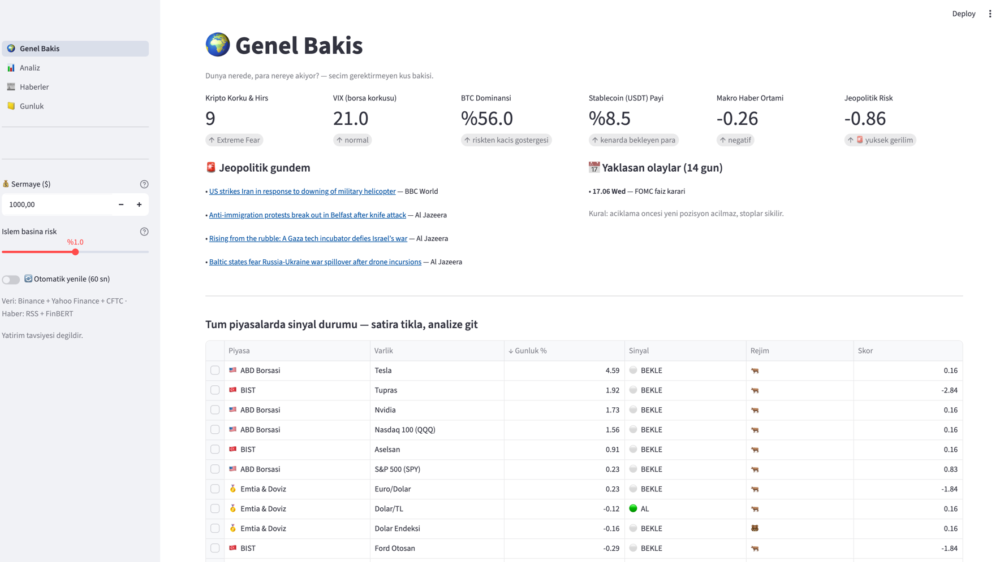
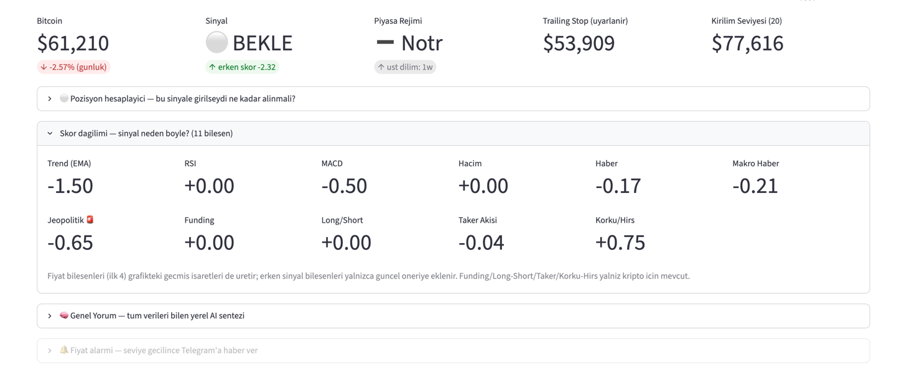
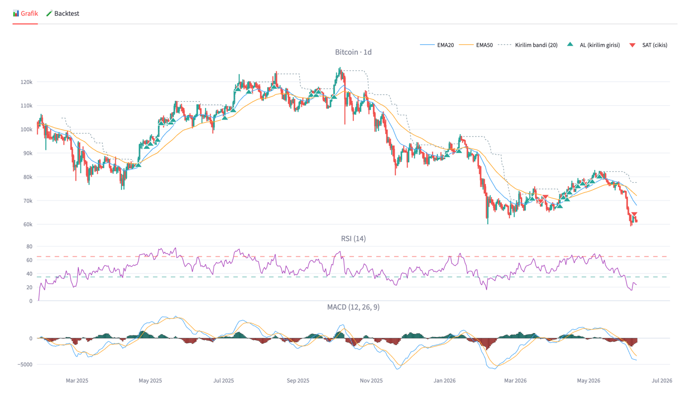
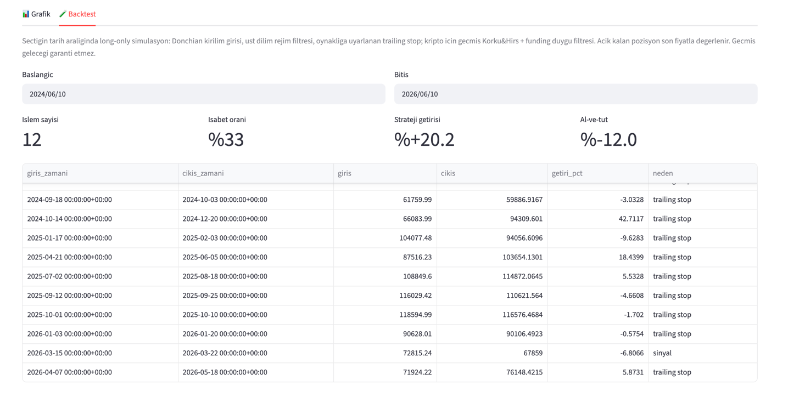
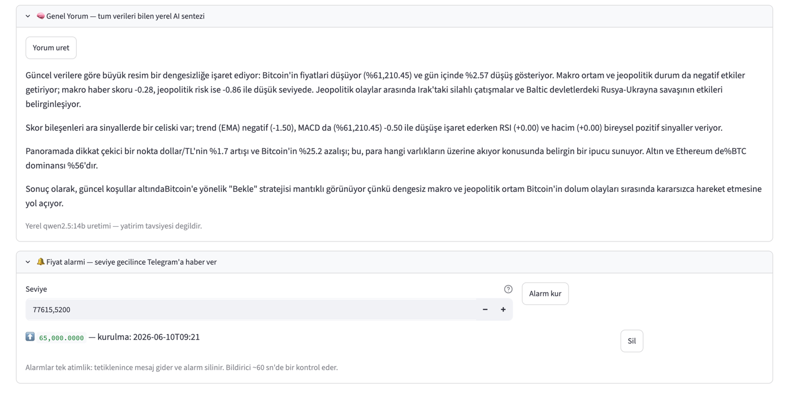
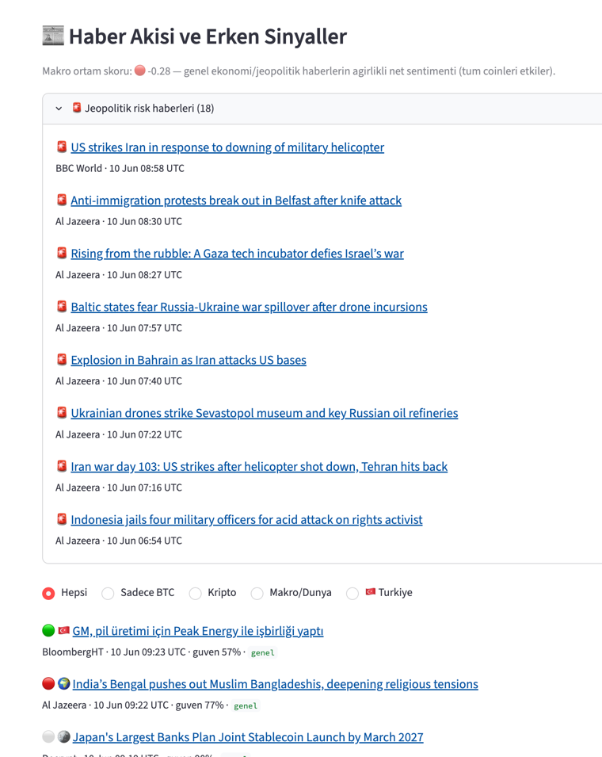
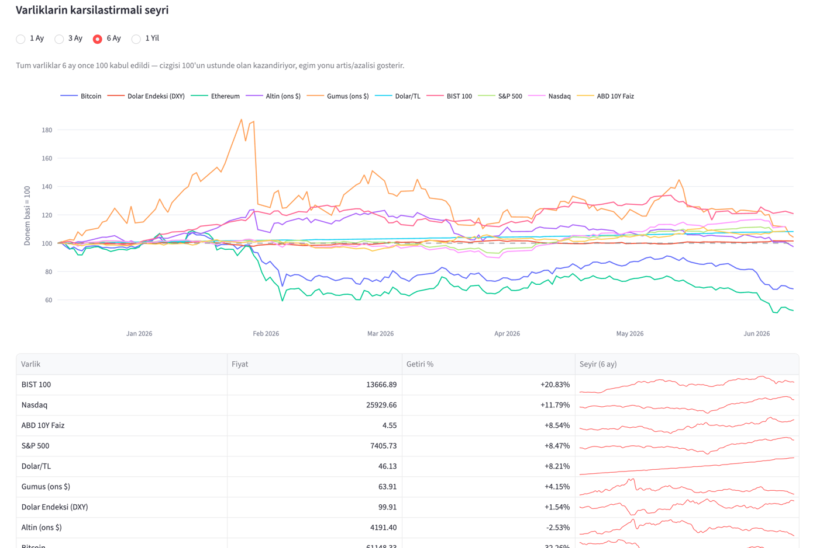
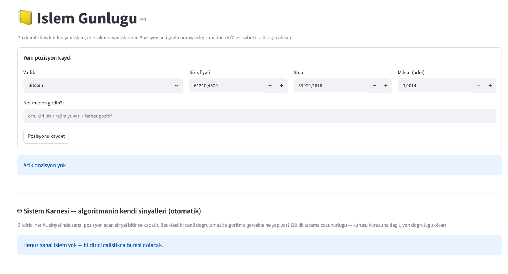

<div align="center">

# 📈 AL-SAT

**Çok piyasalı sinyal paneli — kripto · ABD borsası · BIST · emtia & döviz**

*Nerede giriş, nerede çıkış? Tamamen ücretsiz veri kaynakları ve yerel AI ile.*




*🌍 Genel Bakış: 39 varlığın sinyal durumu, jeopolitik gündem, yaklaşan olaylar — tek ekranda, seçim gerektirmeden.*

</div>

> ⚠️ **Bu proje eğitim ve araştırma amaçlıdır. Yatırım tavsiyesi değildir.**
> Ürettiği sinyaller geçmiş veriye dayalı istatistiksel göstergelerdir; gelecekteki
> performansı garanti etmez. Gerçek parayla vereceğiniz kararların sorumluluğu size aittir.

---

## ✨ Neler var?

### 📊 Sinyal motoru — üç katmanlı, gerekçeli

Her varlık için tek kelimelik hüküm (🟢 AL / 🔴 SAT / ⚪ BEKLE) ve **nedeni**:
11 bileşenli skor dağılımı teknikten habere, funding'den jeopolitiğe her bileşenin
katkısını ayrı gösterir — kara kutu yok.



| Katman | İçerik | Nerede |
|---|---|---|
| **Rejim** | Üst zaman diliminde EMA50/200 — düşüş rejiminde AL üretilmez | Grafik + backtest + canlı |
| **Tetik** | Donchian-20 kırılımı (giriş) + oynaklığa uyarlanan 3-5×ATR trailing stop (çıkış) | Grafik + backtest + canlı |
| **Erken sinyal** | Haber sentimenti (TR+EN) · makro & jeopolitik skor · funding rate · long/short · taker akışı · Korku & Hırs | Canlı öneri |

### 🕯️ Grafik — geçmiş sinyaller gözünün önünde

Candlestick + EMA20/50 + kırılım bandı + geçmiş ▲AL/▼SAT işaretleri + RSI + MACD.
"Bu strateji geçmişte nerede girerdi?" sorusu grafiğin üstünde cevaplanır.



### 🧪 Backtest — tek varlık ve tüm sepet

Tarih aralığını sen seç; rejim filtresi, uyarlanan trailing ve (kripto için) geçmiş
duygu verisi dahil simülasyon. Genel Bakış'taki **portföy backtest** ise dağılım
kurallarıyla bütün sepeti test eder — örnek 2 yıllık sonuç: +%30.6, max düşüş −%22.6.



### 🧠 Yerel AI yorumu — tüm verileri bilen sentez

Skor bileşenleri, rejim, panorama, haberler, türev verileri... hepsi yerel LLM'e
(Qwen 2.5, Ollama) verilir; 150 kelimelik bütüncül Türkçe yorum üretir.
**Hiçbir veri makinenizden çıkmaz.**



### 📰 Haberler — iki dilli sentiment + jeopolitik radar

İngilizce kaynaklar FinBERT ile, Türkçe kaynaklar (BloombergHT, Investing TR)
Türkçe BERT ile etiketlenir. Savaş/saldırı haberleri 🚨 ile sabitlenir ve skoru
otomatik aşağı çeker — finans modeli savaşı "nötr" sanıyordu, biz sanmıyoruz.



### 🌍 Panorama — para nereye akıyor?

Tüm varlık sınıfları dönem başı 100'e endekslenir; kim kazandırıyor kim kaybettiriyor,
eğim yönüyle tek bakışta. 1 ay / 3 ay / 6 ay / 1 yıl dönem seçimi + sparkline tablo.



### 📒 Günlük + Sistem Karnesi

Kendi işlemlerini kaydet (K/Z, isabet); sistem de **kendi sinyallerini otomatik
kâğıt üzerinde işler** — backtest'in canlı doğrulaması birikir.



### 🤖 Telegram botu — cebinde konuşan analist

- Sinyal değişiminde anlık mesaj, her sabah 09:00 raporu, fiyat alarmları
- `/durum` · `/sinyal BTC` · `/karne` · `/takvim` · `/alarm BTC 65000` · `/yardim`
- Komut dışı her mesaja **canlı verilere bakarak** yerel AI cevap verir;
  sohbet hafızalıdır — *"peki düşerse?"* gibi takip soruları bağlamını bulur.

### 💰 Risk yönetimi — profesyonel kurallar gömülü

- **%1-2 kuralı** pozisyon hesaplayıcısı: stop mesafesinden adet/tutar türetir
- **Dağılım önerisi**: AL sinyallilere skor oranlı pay; tek varlık ≤%15, tek piyasa ≤%50, kalan nakit
- **Ekonomik takvim**: FOMC/NFP yaklaşırken "yeni pozisyon açma" uyarısı
- **CFTC COT**: büyük oyuncuların haftalık pozisyonu ve 4 haftalık yön değişimi

---

## 🚀 Kurulum

Gereksinimler: Python 3.12+ · macOS/Linux · ~4 GB disk (AI modelleri) · 16 GB RAM önerilir

```bash
git clone https://github.com/apo-bozdag/alsat.git && cd alsat
python3 -m venv .venv
.venv/bin/pip install -r requirements.txt

# Yerel AI (opsiyonel ama önerilir — AI yorum ve bot cevapları için)
brew install ollama            # veya https://ollama.com
ollama serve &
ollama pull qwen2.5:14b        # 16 GB RAM; daha azı için: qwen2.5:7b
```

İlk çalıştırmada sentiment modelleri (~900 MB: FinBERT + Türkçe BERT) otomatik iner.

```bash
.venv/bin/streamlit run app.py          # dashboard → http://localhost:8501
```

### Telegram botu (opsiyonel)

1. Telegram'da **@BotFather** → `/newbot` → token'ı al
2. Botuna herhangi bir mesaj at (sohbeti başlatmak için şart)
3. `https://api.telegram.org/bot<TOKEN>/getUpdates` adresinde `"chat":{"id":...}` değerini bul
4. Kök dizinde `.secrets.json` oluştur (şablon: `.secrets.example.json`):

```json
{ "telegram_token": "123456:ABC...", "chat_id": "123456789" }
```

5. Bildiriciyi başlat — bot yalnızca senin chat_id'ne cevap verir:

```bash
nohup .venv/bin/python -u notifier.py > notifier.log 2>&1 &
```

---

## 🗂️ Veri kaynakları — hepsi ücretsiz, API key'siz

| Kaynak | Veri |
|---|---|
| Binance Spot + Futures API | OHLCV, funding rate, long/short, taker akışı (geçmişiyle) |
| Yahoo Finance (yfinance) | Hisse/endeks/emtia/döviz OHLCV — kişisel/araştırma kullanımı |
| alternative.me | Korku & Hırs endeksi (2018'den beri geçmişi) |
| CoinGecko | BTC dominansı, stablecoin payı |
| CFTC (resmi) | COT haftalık büyük oyuncu pozisyonları |
| RSS | Cointelegraph, Decrypt, Bitcoin Magazine, CNBC, MarketWatch, BBC, Al Jazeera, BloombergHT, Investing TR |
| Yerel modeller | ProsusAI/finbert (EN), savasy/bert-base-turkish-sentiment-cased (TR), Qwen 2.5 (Ollama) |

Hiçbir veri repo'da dağıtılmaz; herkes kendi makinesinde çeker. Hiçbir veri
makinenizden dışarı çıkmaz (Telegram mesajları hariç).

## 🏗️ Mimari

```
app.py                  # Streamlit girişi (4 sayfa: Genel Bakış, Analiz, Haberler, Günlük)
notifier.py             # Telegram botu + tarayıcı (bağımsız süreç)
src/
├── config.py           # TÜM ayarlar: varlıklar, ağırlıklar, eşikler, kaynaklar
├── data/               # binance, yahoo, news(RSS), macro(VIX/dominans), cot, econcal, panorama
├── indicators/ta.py    # EMA, RSI, MACD, ATR, Donchian — saf pandas
├── signals/            # engine (rejim+kırılım+skor), backtest, portfolio_backtest
├── sentiment/          # analyzer (2 dilli BERT), mapper (haber→varlık), llm (Ollama)
├── portfolio/          # allocator (%1-2 kuralı), journal, scorecard, alarms
├── reporting.py        # sabah raporu
├── assistant.py        # Telegram komutları + AI sohbet
└── ui/                 # shared (cache), sayfalar, grafik bileşenleri
```

Strateji parametreleri tarama ile seçildi (8 coin × 3 yıl + 6 varlık × 2 yıl);
gerekçeler `src/config.py` yorumlarında. Tüm eşik/ağırlıklar oradan değiştirilebilir.

## ⚠️ Bilinen sınırlar

- Haber geçmişi ücretsiz kaynaklarda yok → haber bileşeni backtest'e girmez
  (Korku & Hırs ve funding geçmişi girer)
- Sinyal karnesi 30 dk tarama çözünürlüğündedir — yön doğruluğunu ölçer
- CPI takvimi yok (BLS/FRED key'siz erişimi kapalı); FOMC + NFP var
- Yerel 14B modelin Türkçesi ara sıra devrik olabilir; cevaplar otomatik temizlenir
- macOS yeniden başlatılırsa dashboard ve bildirici elle başlatılmalıdır

## 📄 Lisans

MIT — [`LICENSE`](LICENSE). Veri sağlayıcıların kendi kullanım şartları geçerlidir.
